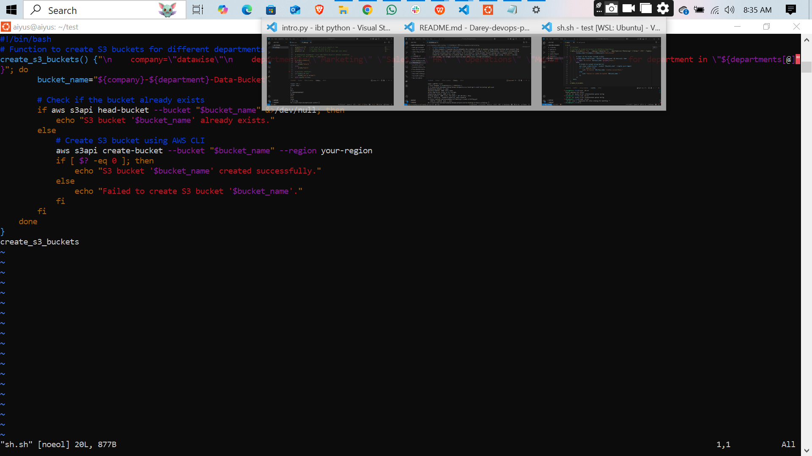

# error-handing-in-shell-scripting
In this project, I learned how to automate the creation of AWS S3 buckets using a Bash function with control flow statements like loops and conditionals. The script loops through a list of departments, checks if a corresponding S3 bucket already exists, and creates it if it doesn’t, using dynamic bucket naming with a company prefix. This helped me understand how to combine Bash scripting with AWS CLI commands, handle logic using `if-else`, iterate over arrays, and manage cloud resources more efficiently through automation.
 
## image
